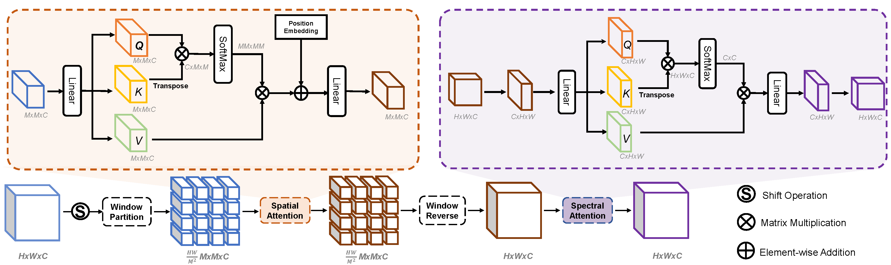
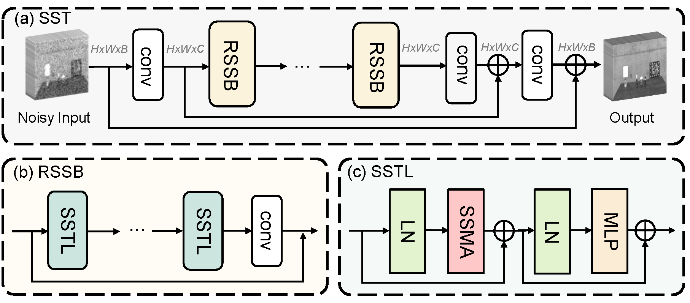
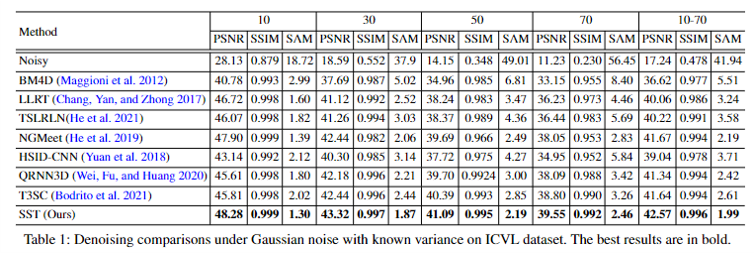
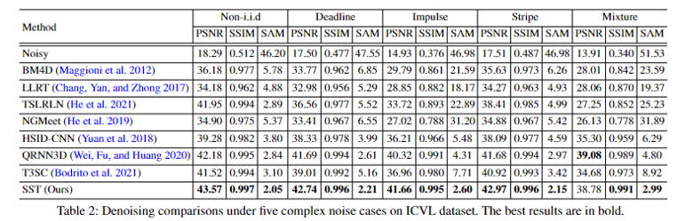
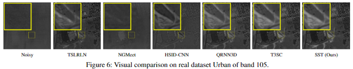
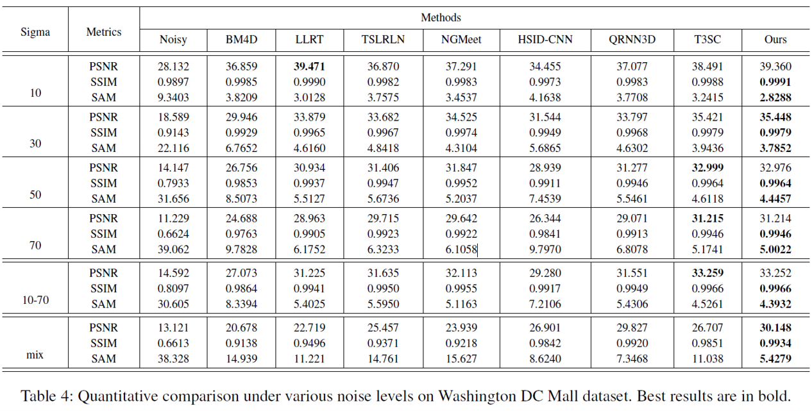
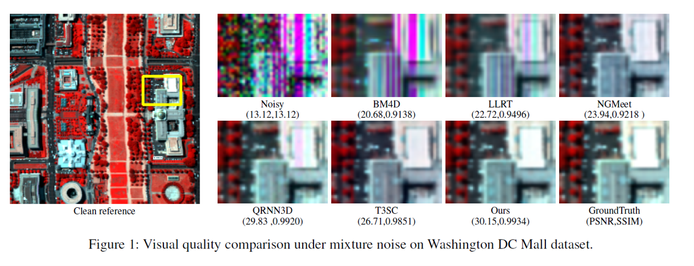

# This repository contains the official implementation of " Spatial-Spectral Transformer for Hyperspectral Image Denoising" in AAAI 2023

<hr />

> **Abstract:** *Hyperspectral image (HSI) denoising is a crucial preprocessing procedure for subsequent HSI applications. Unfortunately, though witnessing the development of deep learning in HSI denoising area, existing convolution-based methods face the trade-off between computational efficiency and capability to model non-local characteristics of HSI. In this paper, we propose a Spatial-Spectral Transformer (SST) to alleviate this problem. To fully explore intrinsic similarity characteristics in both spatial dimension and spectral dimension, we conduct non-local spatial self-attention and global spectral self-attention with Transformer architecture. The window-based spatial self-attention focuses on the spatial similarity beyond neighboring region. While, spectral self-attention exploits the long-range dependencies between highly correlative bands. Experimental results show that our proposed method outperforms the state-of-the-art HSI denoising methods in quantitative quality and visual results.* 
<hr />

## Network Architecture

 
<p align="center">
 
</p>

## Installation
```
git clone https://github.com/MyuLi/SST.git
cd SST
pip install -r requirements.txt
```

## Contents
[1. Prepare Dataset](#1) 

[2. Models](#2) 

[3. Traning and Tetsting](#3) 

[4. Results](#4) 

<p id="1"></p> 

## Prepare Dataset
All the testing data are avalibal at [Baidu Disk](https://pan.baidu.com/s/1GqjTFCtNJkkqG4ENyNUFhQ?pwd=azx0) code:azx0.  

Due to the space limitation, we only provide some examples of testing data in [Google Driver](https://drive.google.com/drive/folders/1Rd4L7YsEoHolVcPxaD8kND3fRxviMHay?usp=sharing). 

You can also generate testing samples by yourself through utility/dataset.py.

### ICVL dataset
* The entire ICVL dataset download link: https://icvl.cs.bgu.ac.il/hyperspectral/
1. split the entire dataset into training samples, testing samples and validating samples. The files used in training are listed in utility/icvl_train_list.txt.

2. generate lmdb dataset for training

```
python utility/lmdb_data.py
```

3. download the testing data from BaiduDisk or generate them by yourself through

```
python utility/mat_data.py
```

### WDC dataset
* The entire WDC dataset download link: https://engineering.purdue.edu/~biehl/MultiSpec/hyperspectral.html

The codes for split it to traning, testing, validating are available at utility/mat_data.py splitWDC().  Run the createDCmall() function in utility/lmdb_data.py to generate training lmdb dataset.
### Urban dataset
* The training dataset are from link: https://apex-esa.org/. The origin Urban dataset are from link:  https://rslab.ut.ac.ir/data.

1. Run the create_big_apex_dataset() funtion in utility/mat_data.py to generate training samples.

2. Run the createDCmall() function in utility/lmdb_data.py to generate training lmdb dataset.

<p id="2"></p> 

## Models


| Task | Method | Params (M) | Dataset| Checkpoints|
| :-----: | :------ | :--------: | :-------: | :------: | 
| Gaussian noise| SST | 4.10 | ICVL| [GoogleDriver](https://drive.google.com/drive/folders/1U4qYx0IGsfkqEskRmuJMBDCt-EVPGC1_?usp=sharing)|
| Complex noise | SST |4.10 | ICVL| [GoogleDriver](https://drive.google.com/drive/folders/1U4qYx0IGsfkqEskRmuJMBDCt-EVPGC1_?usp=sharing)|
| Gaussian noise| SST | 22.69| Washington DC Mall| [GoogleDriver](https://drive.google.com/file/d/1IRYPCjFeOREbxmOzJl86BhLxGnnDZcqe/view?usp=share_link)|
| Complex noise | SST |22.69 | Washington DC Mall| [GoogleDriver](https://drive.google.com/file/d/1cyYOvYnJ9Q4LiDkEeRhJYJmruLsCYmj2/view?usp=share_link)|
| Real noise | SST |22.76 | Urban | [GoogleDriver](https://drive.google.com/file/d/1HsPvLVP76vgAZj-9QiSVkAz9Uw_Iwc5d/view?usp=share_link)|

* Checkpoints are also available at [Baidu Disk](https://pan.baidu.com/s/1GqjTFCtNJkkqG4ENyNUFhQ?pwd=azx0) code:azx0  


<p id="3"></p> 

## Training and Testing

### Training on ICVL dataset
```
#for gaussian noise
python hsi_denoising_single.py -a sst -p sst_gaussian -b 8 

#for comlpex noise
python hsi_denoising_complex.py -a sst -p sst_gaussian -b 8 

```
### Testing on ICVL dataset
```
#for guassian noise
python hsi_denoising_test.py -a sst -p sst_gaussian -r -rp checkpoints/checkpoints_gaussian.pth  --testdir  /data/HSI_Data/icvl_noise_50/512_10_70/

#for complex noise
python hsi_denoising_test.py -a sst -p sst_complex -r -rp checkpoints/checkpoints_complex.pth --testdir  /data/HSI_Data/icvl_noise_50/512_noniid/
```
***
### Training on Wdc dataset
```
#for gaussian noise
python hsi_denoising_single.py -a sst_wdc -p sst_gaussian -b 8 

#for comlpex noise
python hsi_denoising_complex.py -a sst_wdc -p sst_gaussian -b 8 

```
### Testing on Wdc dataset
```
#for guassian noise
python hsi_denoising_test.py -a sst_wdc -p sst_gaussian -r -rp checkpoints/wdc_gaussian.pth --testdir /data/HSI_Data/Hyperspectral_Project/WDC_noise/fixed/


#for complex noise
python hsi_denoising_test.py -a sst_wdc -p sst_complex -r -rp checkpoints/wdc_complex.pth --testdir /data/HSI_Data/Hyperspectral_Project/WDC_noise/mix/
```
***
### Training for real dataset
```
python hsi_denoising_urban.py -a sst_urban -p sst_gaussian -b 8 
```
### Testing on real dataset
```

python hsi_denoising_urban_test.py -a sst_urban -p sst_urban -r -rp checkpoints/urban_real.pth 

```

<p id="4"></p> 

## Results
Experiments are performed on different datasetas, including ICVL dataset (Gaussian noise and Complex noise) and Urban dataset. 

<details>
<summary><strong>Gaussian noise on ICVL dataset</strong> (click to expand) </summary>

 
</details>

<details>
<summary><strong>Complex noise on ICVL dataset</strong> (click to expand) </summary>

 
</details>
<details>
<summary><strong>Real data Denoising</strong> (click to expand) </summary>
 
</details>

<details>
<summary><strong>Denoising on Washington DC Mall</strong> (click to expand) </summary>
 
 
</details>


